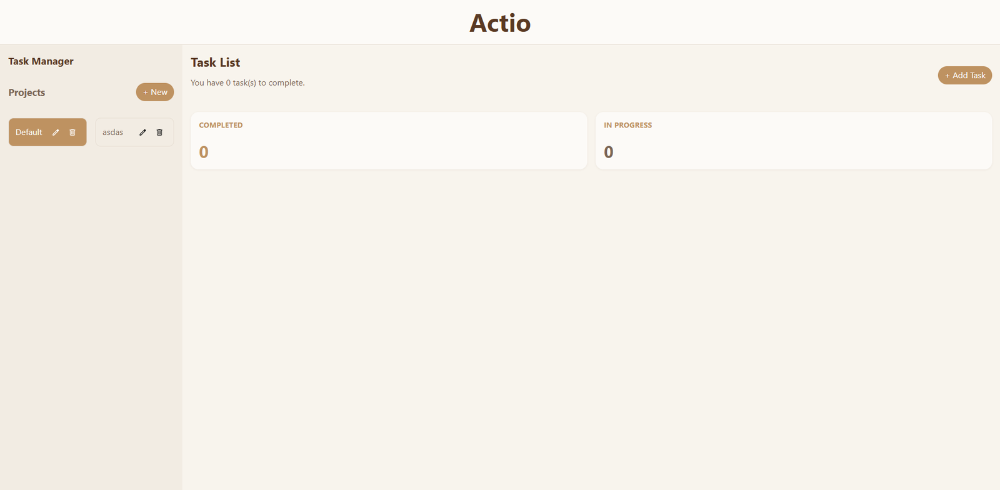
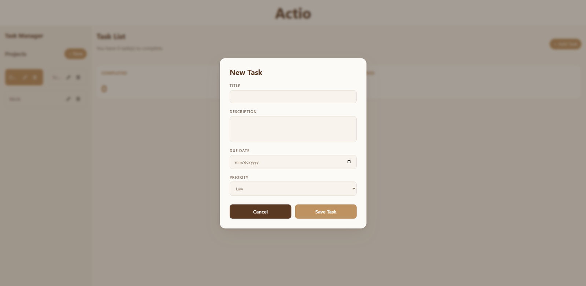
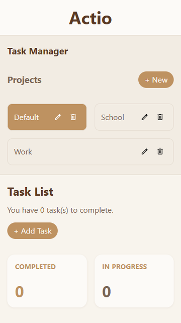
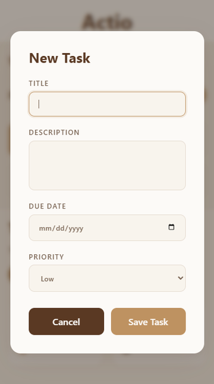
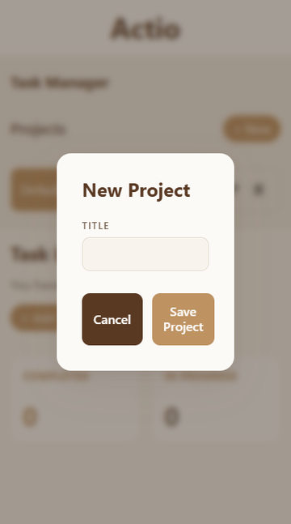

# Actio

**Actio** is a to-do website built as part of **The Odin Project** curriculum, a comprehensive web development course.

Below, you can see what the website looks like. If you want to jump straight into a test drive, click [here](https://dyegocouto.github.io/actio/) to see a live demo!

## Showcase

  
  
  

## Available on Mobile 📱

The website has a responsive layout that adapts to any screen size, large or small.

It also features touch-friendly controls.

## Features

- Create, edit, and delete tasks
- Support for due dates, priorities, and descriptions
- Organize tasks into projects
- Task counter displaying pending and completed tasks
- Data persistence using `localStorage`
- Responsive layout that adapts to any screen size

## Learning Goals 🎯

This project was part of **The Odin Project** curriculum. Ultimately, it was a learning exercise rather than a production-ready application.

| Concept              | Description                                                                                                |
| -------------------- | ---------------------------------------------------------------------------------------------------------- |
| **DOM Manipulation** | Creating and updating HTML elements with JavaScript                                                        |
| **ES6 Modules**      | Separation of concerns across modules (`proj`, `tasks`, `DOM`)                                             |
| **Vite**             | A build tool for bundling JavaScript and CSS modules with fast development and optimized production builds |
| **localStorage**     | Persisting data using JSON serialization and parsing                                                       |
| **Responsive CSS**   | Modern CSS techniques for adapting layouts to all screen sizes (`rem`, `clamp`, `media`)                   |
